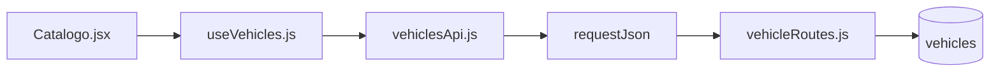
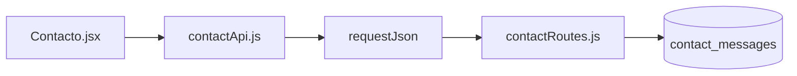
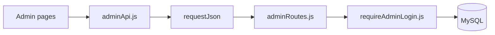

# Code Organization Map

Este mapa mostra o projeto como uma cadeia simples: o utilizador ve uma pagina, a pagina chama um service, o service chama o backend, e o backend guarda ou le dados no MySQL.

```mermaid
flowchart TD
    User[Utilizador] --> Browser[Browser]
    Browser --> React[Frontend React]
    React --> Routes[src/app/App.jsx]
    Routes --> Feature[src/features/*]
    Feature --> Page[pages]
    Feature --> Component[components]
    Feature --> Service[services]
    Service --> Http[src/shared/services/http.js]
    Http --> Api[/api]
    Api --> Express[server/index.js]
    Express --> BackendRoutes[server/routes/*Routes.js]
    BackendRoutes --> Middleware[server/middleware]
    BackendRoutes --> Database[(MySQL)]
```

## Regra Principal

Cada area vive dentro da sua feature.

```text
src/features/
  vehicles/
  contact/
  finance/
  trade-in/
  test-drive/
  auth/
  admin/
  blog/
  home/
  about/
  not-found/
```

Dentro de cada feature, estas sao as pastas possiveis. A feature so tem as pastas que realmente usa.

```text
feature-name/
  pages/       paginas dessa area
  components/  pecas pequenas usadas pelas paginas
  data/        textos, opcoes e configuracoes da area
  hooks/       logica React reutilizavel
  services/    chamadas HTTP dessa area
  styles/      CSS dessa area
  utils/       funcoes auxiliares dessa area
```

Exemplo: se uma area nao tiver chamadas API, nao precisa de pasta `services`.

## Fluxo Do Catalogo



## Fluxo Do Contacto



## Fluxo Do Admin



## Backend

```text
server/
  index.js
  routes/
    healthRoutes.js
    vehicleRoutes.js
    contactRoutes.js
    financeRoutes.js
    testDriveRoutes.js
    tradeInRoutes.js
    authRoutes.js
    adminRoutes.js
  middleware/
    requireUserLogin.js
    requireAdminLogin.js
    authRateLimit.js
  lib/
  tests/
```

## Como Ler O Projeto

1. Abre `src/app/App.jsx` para ver as paginas.
2. Escolhe uma area em `src/features`.
3. Dentro dessa area, abre primeiro `pages`.
4. Se a pagina falar com a API, abre `services`.
5. No backend, abre o ficheiro correspondente em `server/routes`.
